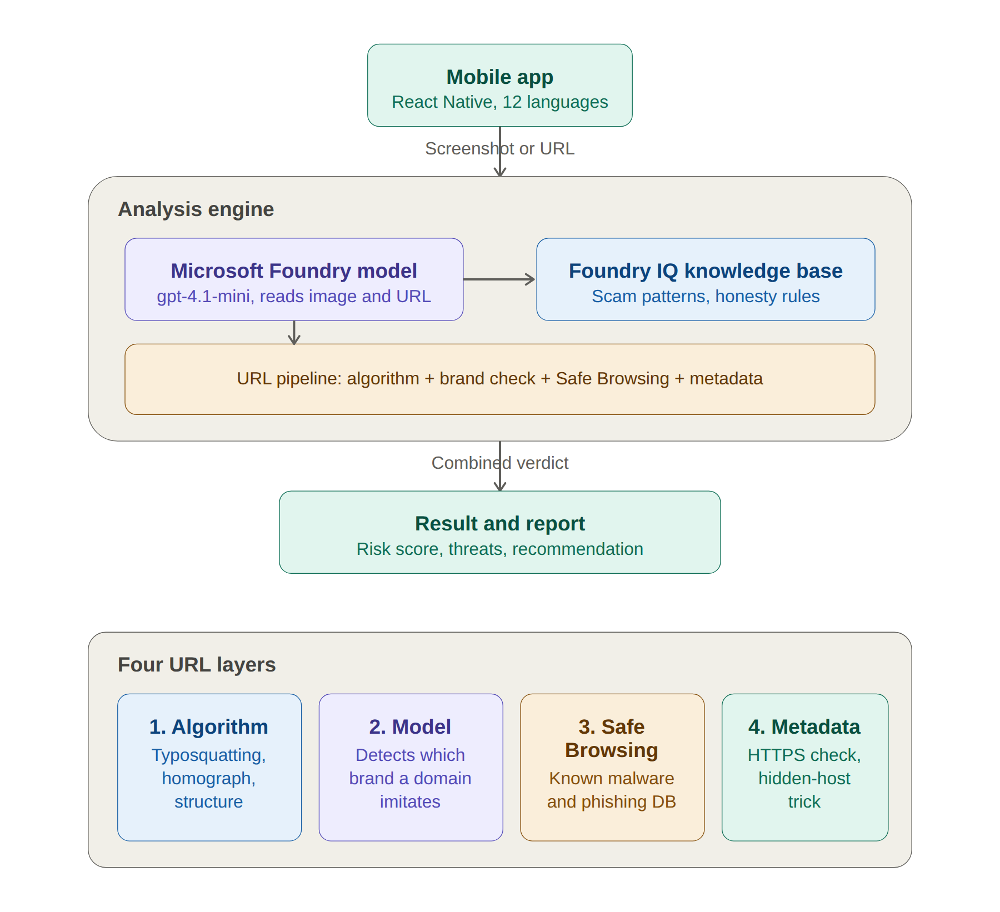

# ScamCheck

ScamCheck is a mobile app that helps people decide whether a message or link is a scam.
A user uploads a screenshot of a suspicious message (SMS, email, WhatsApp, etc.) or pastes
a URL, and the app returns a clear verdict, the specific warning signs it found, and a
practical recommendation — grounded in a scam-detection knowledge base.

Built for the Microsoft Agents League hackathon (Creative Apps track).

## The problem

Scams are now the most common form of fraud, and modern AI-generated scams defeat the old
advice ("look for bad spelling"). People need a fast, plain-language way to check a message
*before* they tap a link or send money — without needing to be a security expert.

## What it does

- **Screenshot analysis** — reads the text, sender, brand, and links in a screenshot and
  assesses whether it matches known scam patterns.
- **URL analysis** — checks a pasted link through four independent layers (see below).
- **Honest verdicts** — never claims a site is "100% safe", and when a domain cannot be
  confidently identified it says so ("not assessed") instead of guessing. This avoids the
  common failure where a tool confidently mislabels an unknown legitimate site.
- **Clear output** — a risk score, separated threat signals and positive findings, and one
  specific recommendation.
- **12 languages** — the interface auto-selects the device language on first launch.

## How it works



The mobile app sends a screenshot or URL to the analysis engine. There, the Microsoft
Foundry model (`gpt-4.1-mini`) reads the content, grounded by a scam-detection knowledge
base (Foundry IQ), while a four-layer URL pipeline runs independent checks. The results are
combined into a single verdict shown on the result and report screen.

### URL analysis — four layers

1. **Algorithm** — deterministic checks for typosquatting (e.g. `facebok.com` vs
   `facebook.com`), homograph/Unicode tricks, suspicious structure, raw IPs, abused TLDs,
   URL shorteners.
2. **Foundry model** — identifies which real brand (if any) a domain is imitating, with no
   manual brand list, and gives an independent verdict.
3. **Google Safe Browsing** — checks the URL against Google's database of known malware and
   phishing sites. It does **not** visit the link; it only queries the threat database.
4. **Metadata** — reads transport security (HTTP vs HTTPS) and the embedded-credential
   (`@` in the authority) trick directly from the URL string. No network request.

The four results are combined; an authoritative Safe Browsing hit overrides a low score.

## Tech stack

- **Frontend:** React Native (Expo SDK 54), JavaScript
- **AI model:** Microsoft Foundry — Azure OpenAI `gpt-4.1-mini`
- **Knowledge base:** Foundry IQ (Azure AI Search) built from a scam-detection reference
  document covering 8 channels and 23 scam categories, including AI/deepfake and
  authorised-push-payment fraud
- **Threat intelligence:** Google Safe Browsing API
- **i18n:** custom lightweight localization with `expo-localization`

## Microsoft IQ integration (and an honest note)

The Foundry IQ knowledge base was built in the Foundry portal and verified in the
playground: it grounds the model's answers in the scam-detection document and follows the
honesty rules.

For this mobile demo, the app calls the Foundry model directly and grounds it by passing
the same knowledge as a system prompt, rather than performing live server-side IQ retrieval.
The reason is architectural: live IQ retrieval uses managed identity, which needs a server
and cannot run securely from a phone. This was a deliberate demo-stage choice.

For a real, multi-user release, the API key must move behind a backend (for example Azure
Functions), and that backend should perform live IQ retrieval. The current build keeps keys
in a local `.env` so the app can call the services directly during development.

## Running locally

This is an Expo app.

```bash
npm install
npx expo install expo-localization
npx expo start -c
```

Then open it with Expo Go on a device, or in an emulator.

### Required environment variables

Create a `.env` file in the project root (it is git-ignored — never commit it):

```
EXPO_PUBLIC_FOUNDRY_API_KEY=your-foundry-api-key
EXPO_PUBLIC_SAFE_BROWSING_API_KEY=your-google-safe-browsing-api-key
```

- The Foundry key comes from the Azure AI Foundry portal (the model's API key).
- The Safe Browsing key comes from Google Cloud Console (enable the Safe Browsing API,
  then create an API key).

If the Safe Browsing key is missing, that layer is skipped gracefully and the rest of the
analysis still runs.

## Project structure

```
App.js                     UI, screens, navigation, i18n wiring
localization.js            12-language strings + device-language detection
utils/foundryService.js    Foundry model calls + embedded knowledge base
utils/linkAnalyzer.js      deterministic URL checks (algorithm + metadata)
utils/safeBrowsing.js      Google Safe Browsing lookup
```

## Privacy

The app does not store messages or screenshots. Analysis happens per request, and the app
always recommends verifying anything involving money, credentials, or account changes
through an official channel the user finds independently.

## Limitations

- No tool can detect every scam; ScamCheck reasons by pattern and can miss novel attacks.
  It is an aid, not a guarantee. Always verify independently.
- Translations for less widely spoken languages may contain minor errors.
- Arabic text is translated, but full right-to-left layout mirroring is not yet enabled.
